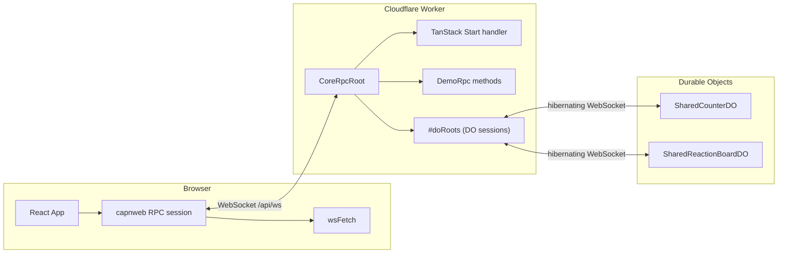
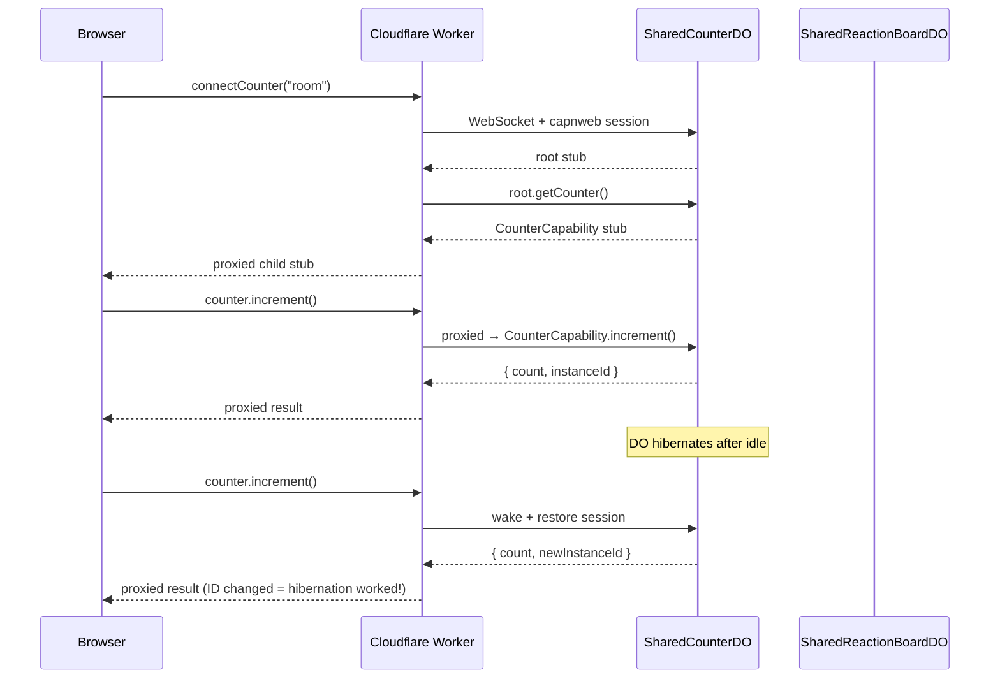

# TanStack Start + Cloudflare Workers + WebSocket RPC

A reference starter that runs [TanStack Start](https://tanstack.com/start) on [Cloudflare Workers](https://developers.cloudflare.com/workers/) with all server communication routed over a single persistent WebSocket connection using [capnweb](https://github.com/cloudflare/capnweb) RPC.

Both TanStack Start **server functions** (`createServerFn`) and custom **worker RPC methods** share the same WebSocket, with automatic fallback to HTTP when the socket is unavailable.

## How it works

### Architecture



### Server functions over WebSocket

TanStack Start server functions normally make HTTP fetch requests to endpoints like `POST /rsc/__ACTIONS_0`. This starter reroutes them over WebSocket in two layers:

1. **`src/start.ts`** — Injects `wsFetch` into TanStack Start's `createStart()` via the `serverFns.fetch` option (the framework's official hook for custom transport). No `globalThis.fetch` patching is needed.
2. **`server-entry.ts`** — The `CoreRpcRoot` class exposes a `fetch(request): Response` method that forwards incoming requests to `tanstackHandler.fetch()`, which is the standard TanStack Start SSR handler.

The result: `createServerFn` calls are serialized as `Request` objects, sent over the WebSocket as capnweb RPC calls to `CoreRpcRoot.fetch()`, processed by TanStack Start on the worker, and the `Response` comes back over the same socket. App code doesn't need to know any of this — server functions just work.

### Direct RPC methods

For worker-only logic that doesn't need TanStack Start's server function machinery, you can define methods directly on the `RpcTarget` subclass. The `withDemoRpc` mixin adds methods like `rollDice()`, `banner()`, and `nameColors()` that are callable from the client as typed async method calls:

```ts
const rpc = getRpc()
const results = await rpc.rollDice(5)     // number[]
const banner = await rpc.banner('HELLO')  // string
```

These bypass TanStack Start entirely — capnweb handles serialization, dispatch, and return values directly.

### Connection lifecycle

`initSocket()` is called once from the root route (`src/routes/__root.tsx`). It:

- Opens a WebSocket to `/api/ws`
- Creates a capnweb RPC session on the socket
- Reconnects automatically on disconnect (1s delay)

Server functions are routed over WebSocket via `wsFetch`, injected into TanStack Start's `createStart()` as `serverFns.fetch`. Falls back to native HTTP when the socket isn't connected.

## Durable Object multiplexing with hibernation

The `/multiplexing` route demonstrates how to proxy capnweb RPC connections from the browser through the worker to multiple Durable Objects, with full hibernation support. The DOs can sleep between interactions, wake on demand, and the RPC stubs the client holds continue to work seamlessly.

### Architecture



### The pattern

This follows the same approach used in the [capnweb hibernation tests](https://github.com/niccolozy/capnweb), where a client holds a root stub and acquires child capability stubs from it. The difference here is that the **worker** is the client to the DO, and the browser client receives the child stubs proxied through the worker.

**1. DO exposes a root with child capabilities**

The DO's RPC root doesn't expose the API directly. Instead, it has a method that returns a child `RpcTarget`:

```ts
class CounterRpcRoot extends RpcTarget {
  getCounter() {
    return new CounterCapability(this.host)
  }
  getInstanceId() {
    return this.host.instanceId
  }
}
```

The DO uses `__experimental_newHibernatableWebSocketRpcSession` so it can hibernate while WebSocket connections remain open.

**2. Worker holds root stubs, passes child stubs to the client**

The worker opens a WebSocket to each DO and creates a capnweb session. It keeps the root stub alive (preventing session shutdown) and calls methods on it to get child capability stubs:

```ts
class CoreRpcRoot extends RpcTarget {
  #doRoots = new Map<string, RpcStub<any>>()

  async connectCounter(roomId: string) {
    const root = await this.#getDoRoot<CounterRootApi>(
      workerEnv!.SHARED_COUNTER, roomId, `counter:${roomId}`,
    )
    return root.getCounter()  // child stub, proxied to client
  }
}
```

capnweb automatically proxies the child stub across the client-worker session. When the browser client calls `counter.increment()`, the call flows: browser → worker → DO.

**3. Browser client uses stubs transparently**

```ts
const counter = await rpc.connectCounter('demo-room')
await counter.subscribe(new Handler())
const result = await counter.increment()
```

The client doesn't know or care that calls are being proxied through the worker to a DO.

### Why this pattern matters

- **Hibernation works**: The DO can sleep between interactions. When it wakes, the constructor re-runs (generating a new `instanceId`), but the capnweb session restores from the WebSocket attachment and held stubs continue to work.
- **No manual bridging**: Unlike raw WebSocket approaches where you'd manually frame messages and translate between protocols, capnweb handles serialization, dispatch, and cross-session proxying automatically.
- **Multiplexed**: A single browser WebSocket to the worker fans out to multiple DO WebSocket connections. Each DO is independent and can hibernate on its own schedule.
- **Bidirectional**: DOs can push to clients via callbacks (e.g., `subscribe(callback)` for real-time counter updates and reactions).

### Hibernation detection

Each DO generates a `crypto.randomUUID()` as `instanceId` in its constructor. The UI shows this ID — when it changes between interactions, you know the DO hibernated and woke up. The `/multiplexing` page displays this with a confetti celebration when a wake-up is detected.

## Demo pages

Each demo page showcases both transport types side by side, with transport badges showing whether each call went over WebSocket or HTTP and the round-trip latency.

| Route | Server Function | capnweb RPC |
|-------|----------------|-------------|
| `/dice` | Compute roll statistics on the server | Roll dice on the worker |
| `/ascii` | Fetch animal facts | Render ASCII art banners |
| `/colors` | Analyze color properties (hue, saturation, lightness) | Generate creative color names |
| `/multiplexing` | — | Shared counter + reaction board via two Durable Objects with hibernation |

## Project structure

```
server-entry.ts          Cloudflare Worker entry; WebSocket upgrade + RPC root
src/
  start.ts               TanStack Start config; injects wsFetch as server function transport
  ws.ts                  WebSocket singleton; capnweb RPC session; wsFetch export
  transport-log.ts       Observable log of transport events (ws vs http) for UI
  demo-rpc.ts            Demo RPC method definitions + DemoApi type
  router.tsx             TanStack Router config
  routes/
    __root.tsx           Root layout; calls initSocket()
    index.tsx            Home page
    dice.tsx             Dice roller demo
    ascii.tsx            ASCII art zoo demo
    colors.tsx           Color palette demo
    multiplexing.tsx     DO multiplexing demo (counter + reaction board)
  do/
    shared-counter.ts    SharedCounterDO with hibernatable capnweb RPC
    shared-guestbook.ts  SharedReactionBoardDO with hibernatable capnweb RPC
  components/
    Header.tsx           Nav header with WebSocket status indicator
    TransportBadge.tsx   Badge showing transport type + latency
    TransportIndicator.tsx  Aggregate WebSocket vs HTTP fetch counts
```

## Getting started

```bash
pnpm install
pnpm dev
```

The dev server runs on `http://localhost:3000`. The WebSocket connects automatically.

## Deploy to Cloudflare

```bash
pnpm deploy
```

This runs `vite build` then `wrangler deploy` using the config in `wrangler.jsonc`.

## Adding your own RPC methods

1. Define the client-side type in a shared interface:

```ts
export interface MyApi {
  myMethod(arg: string): string
}
```

2. Implement the method on an `RpcTarget` subclass or mixin (see `src/demo-rpc.ts` for the pattern)

3. Add the interface to `ServerApi` in `src/ws.ts`:

```ts
export interface ServerApi extends DemoApi, MyApi {
  fetch(request: Request): Response
}
```

The method is now callable from the client via `getRpc().myMethod('hello')`.
